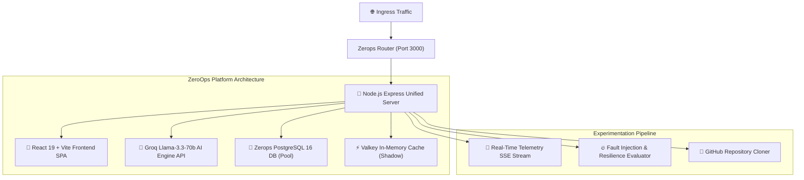

# 🚀 ShadowLabs — Zero-Risk Production Experimentation & AI-Driven SRE Optimization

> **Built for the ZeroOps Hackathon 2026**
> *Benchmark production infrastructure clones, simulate real-time traffic stress, inject chaos faults, and auto-promote optimized configurations using Groq Llama-3.3 AI.*

---


## 📌 Problem Statement & Solution

### The Problem
Modifying cloud infrastructure (attaching Redis/Valkey caches, altering worker instance scaling, or tweaking PostgreSQL database connections) in a live production environment carries immense risk of downtime, high latency, or data corruption for real users.

### The Solution: ShadowLab
**ShadowLab** creates isolated **Shadow Clones** of active Zerops projects. You can safely stress test infrastructure modifications against synthetic traffic bursts, evaluate real-time telemetry curves, inject chaos fault scenarios with **Zero Blast Radius**, and receive automated **Groq Llama-3.3 SRE AI Audit Reports** before clicking **Promote to Production**.

---

## ✨ Key Features

- **🧪 Shadow Experiment Isolation**: Clone live Zerops application services into a isolated benchmarking environment.
- **🤖 Groq Llama-3.3 AI SRE Analyst**: Automated infrastructure optimization evaluation, risk identification, and recommendation powered by Groq's high-speed Llama-3.3 inference engine.
- **🔥 Fault Injection & Chaos Lab**: Inject CPU spikes, DB dropouts, and latency delays to calculate resilience scorecards (`Resilience Score / 100`) without risking production uptime.
- **📡 Real-Time SSE Telemetry Streaming**: Live Server-Sent Events (SSE) stream moving latency & database load curves on Recharts.
- **🐙 GitHub Repository Inspector & Cloner**: Paste any public GitHub URL to automatically detect stack dependencies (`package.json`, `Dockerfile`, `zerops.yaml`) and trigger a Groq AI infrastructure audit.
- **🐘 PostgreSQL Database Integration**: Persistent storage using PostgreSQL connection pooling (`pg`) with automatic schema migrations for `projects`, `experiments`, and `chaos_runs`.
- **📥 SRE Audit Report Exporter**: Download formatted Markdown/JSON SRE Audit reports containing AI analysis and benchmarking data.

---

## 🏗️ Architecture Map



---

## 🛠️ Technology Stack

| Component | Technology Used |
|---|---|
| **Cloud Hosting & Deployment** | [Zerops Platform](https://zerops.io) (`zerops.yaml`) |
| **AI Analyst Engine** | [Groq Llama-3.3-70b Versatile](https://groq.com) |
| **Database** | PostgreSQL 16 (`pg` Connection Pool) |
| **Backend API** | Node.js 20, Express.js, Server-Sent Events (SSE) |
| **Frontend UI** | React 19, Vite, TailwindCSS (AMOLED Pitch Black Theme) |
| **Animations & Charts** | Framer Motion, Recharts, Lucide React |

---

## ⚙️ Environment Variables Setup

Create a `.env` file in the `backend/` directory:

```env
PORT=3000
NODE_ENV=production

# Groq AI API Key (Required for AI Analyst)
GROQ_API_KEY=gsk_your_groq_api_key_here

# PostgreSQL Database Credentials (Auto-filled by Zerops in production)
ZEROPS_DB_HOST=localhost
ZEROPS_DB_PORT=5432
ZEROPS_DB_USER=postgres
ZEROPS_DB_PASSWORD=postgres
ZEROPS_DB_NAME=shadowlab
```

---

## 🚀 Local Quickstart Guide

### 1. Clone Repository
```bash
git clone https://github.com/Sswastik60/ShadowLab.git
cd ShadowLab
```

### 2. Install & Run Backend
```bash
cd backend
npm install
npm start
```

### 3. Install & Run Frontend
```bash
cd ../frontend
npm install
npm run dev
```

Open `http://localhost:5173` (or `http://localhost:3000`) in your browser.

---

## ☁️ Deploying to Zerops

Deploy using the official **Zerops CLI (`zcli`)**:

```bash
zcli push app --setup app
```

`zerops.yaml` handles building both backend dependencies and frontend static assets automatically in Node.js runtime container.

---

## 🏆 Hackathon Judge Demo Walkthrough (3-Minute Script)

1. **Hero Landing Page**: Navigate to the landing page featuring the pitch-black AMOLED dark theme and value proposition.
2. **Production Dashboard**: View connected Zerops service topology, active Node workers, and database load.
3. **Launch Shadow Lab Experiment**: Click **"New Experiment"** or **"Import GitHub Repo"** (`Sswastik60/ShadowLab`), attach a Valkey Cache, and set traffic stress to 1,500 req/sec.
4. **Live Telemetry & Groq AI Audit**: Observe the moving real-time SSE chart showing a 66% latency drop. Inspect Groq Llama-3.3's automated audit reasoning.
5. **Chaos Testing**: Navigate to **Chaos Lab**, inject a *CPU Spike* or *DB Outage* fault scenario, and observe the zero blast radius isolation.
6. **Promote & Export**: Click **"Export Audit"** to download the Markdown report, then click **"Promote to Production"**!

---

## 📄 License

Distributed under the MIT License. Built for the **ZeroOps Hackathon 2026**.
